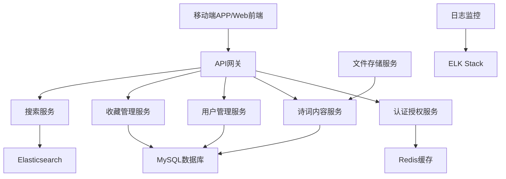
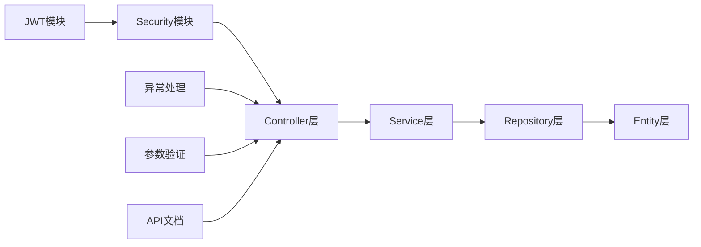
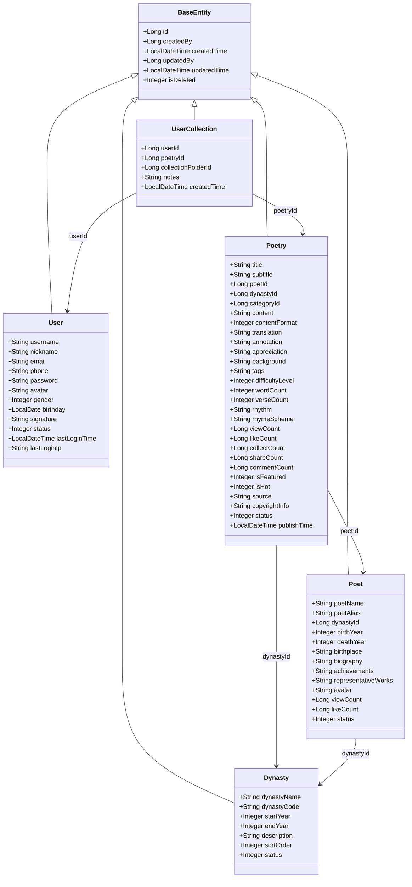
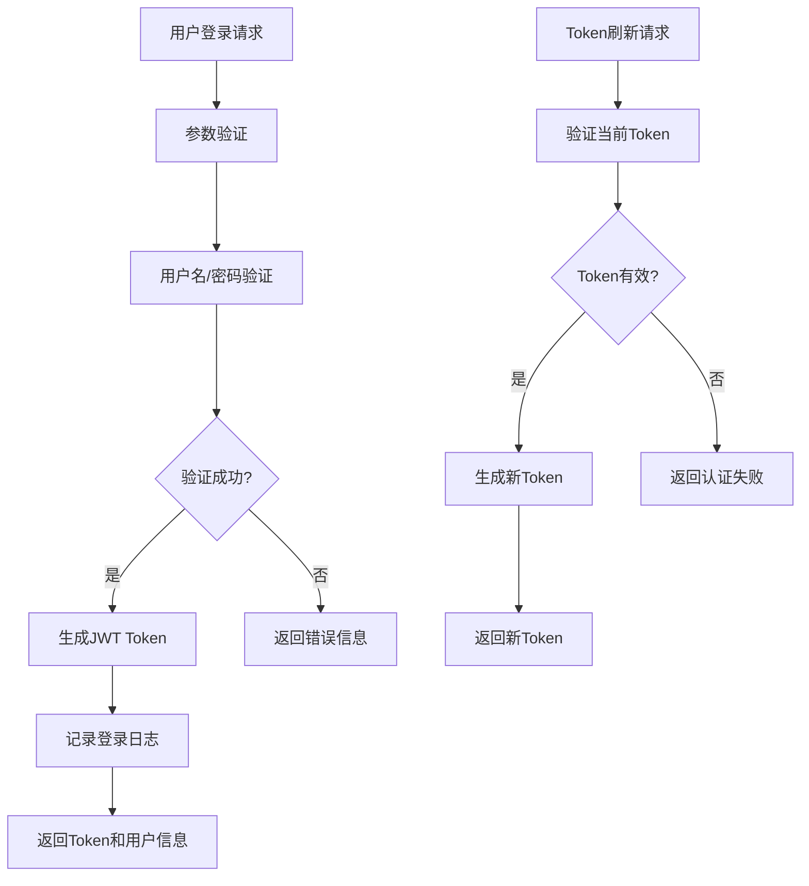
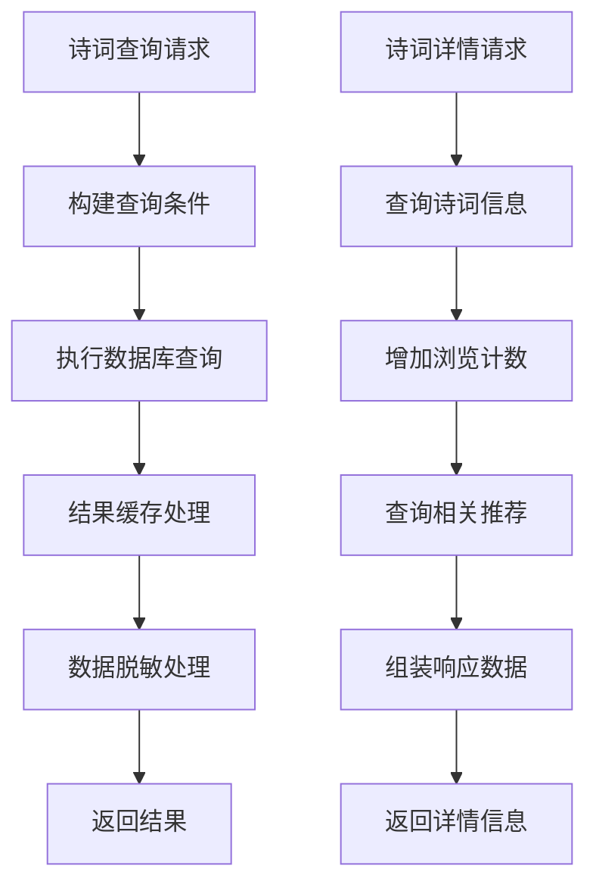
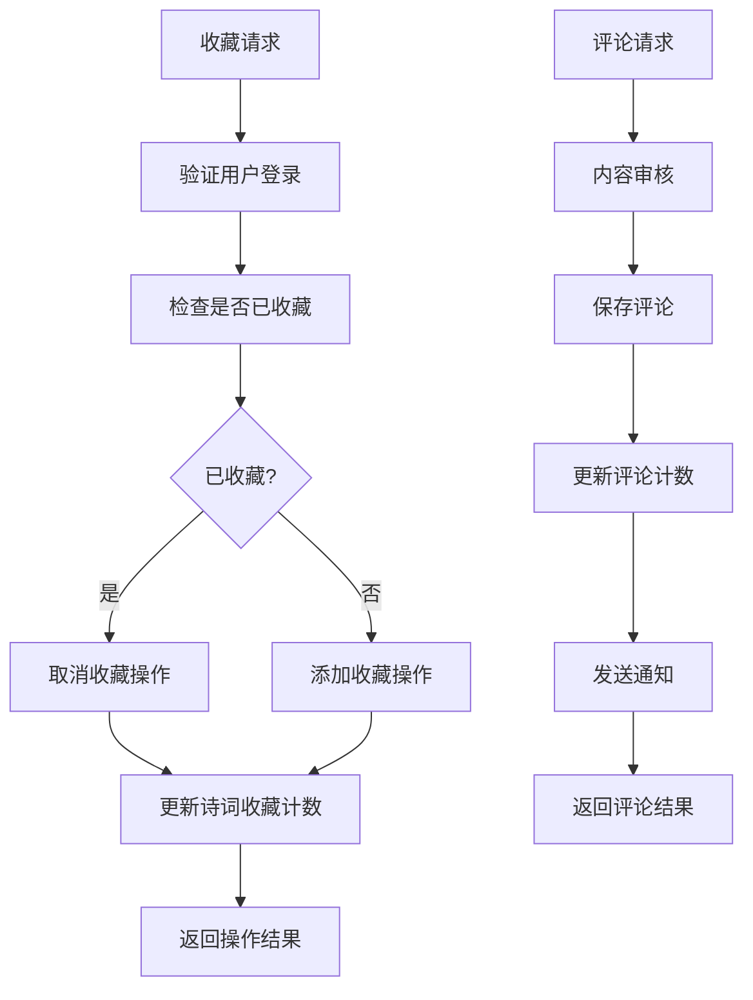
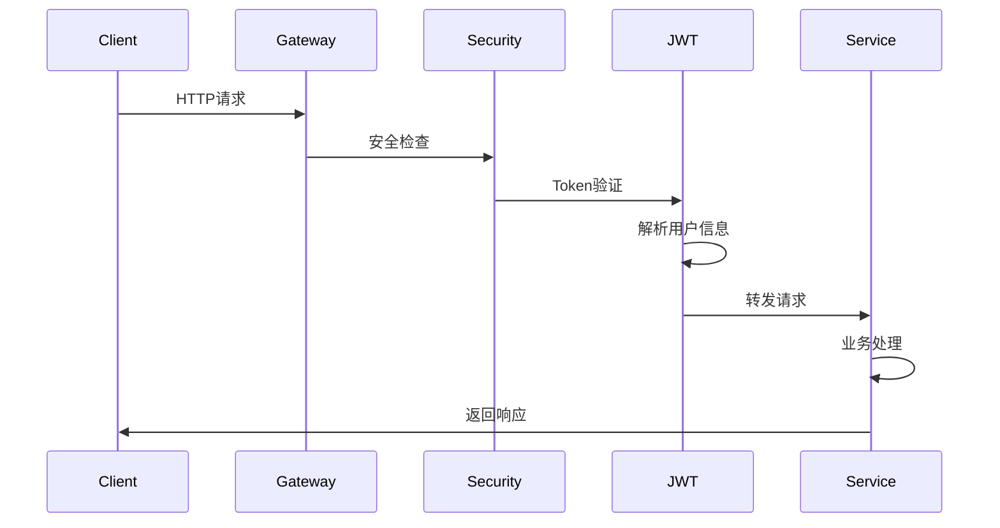
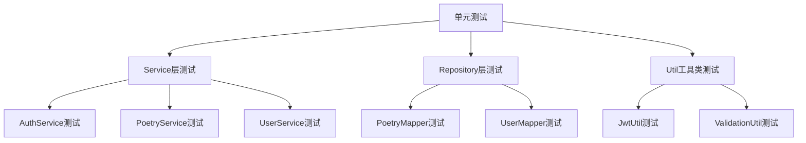

# 企业级诗词APP后端服务设计文档

## 项目概述

### 项目基本信息
- **项目名称**: 企业级诗词APP后端服务
- **项目作者**: Sakura Huang
- **开始时间**: 2025-09-03
- **项目类型**: 企业级后端服务
- **目标**: 构建一个稳定、可扩展、高性能的诗词内容管理与服务平台

### 技术栈选型
- **构建工具**: Gradle Kotlin DSL
- **Java版本**: Java 21 (使用稳定API，不使用预览特性)
- **核心框架**: Spring Boot 3.5.5
- **安全框架**: Spring Security 6.5.3  
- **JWT处理**: JJWT 0.12.7
- **API文档**: Knife4j 4.5.0
- **ORM框架**: MyBatis-Plus 3.5.14
- **数据库**: MySQL 9.4.0

## 系统架构

### 整体架构设计



### 核心模块架构



## 数据库设计

### 核心表结构设计

#### 1. 用户管理模块

```sql
-- 用户基础信息表
CREATE TABLE `sys_user` (
    `id` BIGINT NOT NULL AUTO_INCREMENT COMMENT '用户ID',
    `username` VARCHAR(50) NOT NULL COMMENT '用户名',
    `nickname` VARCHAR(100) DEFAULT NULL COMMENT '昵称',
    `email` VARCHAR(100) DEFAULT NULL COMMENT '邮箱',
    `phone` VARCHAR(20) DEFAULT NULL COMMENT '手机号',
    `password` VARCHAR(255) NOT NULL COMMENT '密码(加密)',
    `avatar` VARCHAR(500) DEFAULT NULL COMMENT '头像URL',
    `gender` TINYINT DEFAULT 0 COMMENT '性别:0-未知,1-男,2-女',
    `birthday` DATE DEFAULT NULL COMMENT '生日',
    `signature` VARCHAR(500) DEFAULT NULL COMMENT '个性签名',
    `status` TINYINT DEFAULT 1 COMMENT '状态:0-禁用,1-启用',
    `last_login_time` DATETIME DEFAULT NULL COMMENT '最后登录时间',
    `last_login_ip` VARCHAR(50) DEFAULT NULL COMMENT '最后登录IP',
    `created_by` BIGINT DEFAULT NULL COMMENT '创建人ID',
    `created_time` DATETIME DEFAULT CURRENT_TIMESTAMP COMMENT '创建时间',
    `updated_by` BIGINT DEFAULT NULL COMMENT '更新人ID',
    `updated_time` DATETIME DEFAULT CURRENT_TIMESTAMP ON UPDATE CURRENT_TIMESTAMP COMMENT '更新时间',
    `is_deleted` TINYINT DEFAULT 0 COMMENT '是否删除:0-否,1-是',
    PRIMARY KEY (`id`),
    UNIQUE KEY `uk_username` (`username`),
    UNIQUE KEY `uk_email` (`email`),
    UNIQUE KEY `uk_phone` (`phone`),
    KEY `idx_status` (`status`),
    KEY `idx_created_time` (`created_time`)
) ENGINE=InnoDB DEFAULT CHARSET=utf8mb4 COLLATE=utf8mb4_unicode_ci COMMENT='用户基础信息表';

-- 角色表
CREATE TABLE `sys_role` (
    `id` BIGINT NOT NULL AUTO_INCREMENT COMMENT '角色ID',
    `role_name` VARCHAR(50) NOT NULL COMMENT '角色名称',
    `role_code` VARCHAR(50) NOT NULL COMMENT '角色编码',
    `description` VARCHAR(255) DEFAULT NULL COMMENT '角色描述',
    `sort_order` INT DEFAULT 0 COMMENT '排序',
    `status` TINYINT DEFAULT 1 COMMENT '状态:0-禁用,1-启用',
    `created_by` BIGINT DEFAULT NULL COMMENT '创建人ID',
    `created_time` DATETIME DEFAULT CURRENT_TIMESTAMP COMMENT '创建时间',
    `updated_by` BIGINT DEFAULT NULL COMMENT '更新人ID',
    `updated_time` DATETIME DEFAULT CURRENT_TIMESTAMP ON UPDATE CURRENT_TIMESTAMP COMMENT '更新时间',
    `is_deleted` TINYINT DEFAULT 0 COMMENT '是否删除:0-否,1-是',
    PRIMARY KEY (`id`),
    UNIQUE KEY `uk_role_code` (`role_code`),
    KEY `idx_status` (`status`)
) ENGINE=InnoDB DEFAULT CHARSET=utf8mb4 COLLATE=utf8mb4_unicode_ci COMMENT='角色表';

-- 用户角色关联表
CREATE TABLE `sys_user_role` (
    `id` BIGINT NOT NULL AUTO_INCREMENT COMMENT 'ID',
    `user_id` BIGINT NOT NULL COMMENT '用户ID',
    `role_id` BIGINT NOT NULL COMMENT '角色ID',
    `created_by` BIGINT DEFAULT NULL COMMENT '创建人ID',
    `created_time` DATETIME DEFAULT CURRENT_TIMESTAMP COMMENT '创建时间',
    PRIMARY KEY (`id`),
    UNIQUE KEY `uk_user_role` (`user_id`, `role_id`),
    KEY `idx_user_id` (`user_id`),
    KEY `idx_role_id` (`role_id`)
) ENGINE=InnoDB DEFAULT CHARSET=utf8mb4 COLLATE=utf8mb4_unicode_ci COMMENT='用户角色关联表';
```

#### 2. 诗词内容模块

```sql
-- 诗词分类表
CREATE TABLE `poetry_category` (
    `id` BIGINT NOT NULL AUTO_INCREMENT COMMENT '分类ID',
    `category_name` VARCHAR(100) NOT NULL COMMENT '分类名称',
    `category_code` VARCHAR(50) NOT NULL COMMENT '分类编码',
    `parent_id` BIGINT DEFAULT 0 COMMENT '父分类ID,0为顶级分类',
    `level` TINYINT DEFAULT 1 COMMENT '分类层级',
    `sort_order` INT DEFAULT 0 COMMENT '排序',
    `description` VARCHAR(500) DEFAULT NULL COMMENT '分类描述',
    `cover_image` VARCHAR(500) DEFAULT NULL COMMENT '分类封面图',
    `status` TINYINT DEFAULT 1 COMMENT '状态:0-禁用,1-启用',
    `created_by` BIGINT DEFAULT NULL COMMENT '创建人ID',
    `created_time` DATETIME DEFAULT CURRENT_TIMESTAMP COMMENT '创建时间',
    `updated_by` BIGINT DEFAULT NULL COMMENT '更新人ID',
    `updated_time` DATETIME DEFAULT CURRENT_TIMESTAMP ON UPDATE CURRENT_TIMESTAMP COMMENT '更新时间',
    `is_deleted` TINYINT DEFAULT 0 COMMENT '是否删除:0-否,1-是',
    PRIMARY KEY (`id`),
    UNIQUE KEY `uk_category_code` (`category_code`),
    KEY `idx_parent_id` (`parent_id`),
    KEY `idx_status` (`status`),
    KEY `idx_sort_order` (`sort_order`)
) ENGINE=InnoDB DEFAULT CHARSET=utf8mb4 COLLATE=utf8mb4_unicode_ci COMMENT='诗词分类表';

-- 朝代表
CREATE TABLE `dynasty` (
    `id` BIGINT NOT NULL AUTO_INCREMENT COMMENT '朝代ID',
    `dynasty_name` VARCHAR(50) NOT NULL COMMENT '朝代名称',
    `dynasty_code` VARCHAR(20) NOT NULL COMMENT '朝代编码',
    `start_year` INT DEFAULT NULL COMMENT '开始年份',
    `end_year` INT DEFAULT NULL COMMENT '结束年份',
    `description` TEXT DEFAULT NULL COMMENT '朝代描述',
    `sort_order` INT DEFAULT 0 COMMENT '排序',
    `status` TINYINT DEFAULT 1 COMMENT '状态:0-禁用,1-启用',
    `created_by` BIGINT DEFAULT NULL COMMENT '创建人ID',
    `created_time` DATETIME DEFAULT CURRENT_TIMESTAMP COMMENT '创建时间',
    `updated_by` BIGINT DEFAULT NULL COMMENT '更新人ID',
    `updated_time` DATETIME DEFAULT CURRENT_TIMESTAMP ON UPDATE CURRENT_TIMESTAMP COMMENT '更新时间',
    `is_deleted` TINYINT DEFAULT 0 COMMENT '是否删除:0-否,1-是',
    PRIMARY KEY (`id`),
    UNIQUE KEY `uk_dynasty_code` (`dynasty_code`),
    KEY `idx_status` (`status`),
    KEY `idx_sort_order` (`sort_order`)
) ENGINE=InnoDB DEFAULT CHARSET=utf8mb4 COLLATE=utf8mb4_unicode_ci COMMENT='朝代表';

-- 作者表
CREATE TABLE `poet` (
    `id` BIGINT NOT NULL AUTO_INCREMENT COMMENT '诗人ID',
    `poet_name` VARCHAR(100) NOT NULL COMMENT '诗人姓名',
    `poet_alias` VARCHAR(200) DEFAULT NULL COMMENT '诗人别名/字号',
    `dynasty_id` BIGINT DEFAULT NULL COMMENT '朝代ID',
    `birth_year` INT DEFAULT NULL COMMENT '出生年份',
    `death_year` INT DEFAULT NULL COMMENT '逝世年份',
    `birthplace` VARCHAR(200) DEFAULT NULL COMMENT '出生地',
    `biography` TEXT DEFAULT NULL COMMENT '生平简介',
    `achievements` TEXT DEFAULT NULL COMMENT '主要成就',
    `representative_works` TEXT DEFAULT NULL COMMENT '代表作品',
    `avatar` VARCHAR(500) DEFAULT NULL COMMENT '头像URL',
    `view_count` BIGINT DEFAULT 0 COMMENT '查看次数',
    `like_count` BIGINT DEFAULT 0 COMMENT '点赞次数',
    `status` TINYINT DEFAULT 1 COMMENT '状态:0-禁用,1-启用',
    `created_by` BIGINT DEFAULT NULL COMMENT '创建人ID',
    `created_time` DATETIME DEFAULT CURRENT_TIMESTAMP COMMENT '创建时间',
    `updated_by` BIGINT DEFAULT NULL COMMENT '更新人ID',
    `updated_time` DATETIME DEFAULT CURRENT_TIMESTAMP ON UPDATE CURRENT_TIMESTAMP COMMENT '更新时间',
    `is_deleted` TINYINT DEFAULT 0 COMMENT '是否删除:0-否,1-是',
    PRIMARY KEY (`id`),
    KEY `idx_dynasty_id` (`dynasty_id`),
    KEY `idx_poet_name` (`poet_name`),
    KEY `idx_status` (`status`),
    KEY `idx_view_count` (`view_count`),
    KEY `idx_like_count` (`like_count`)
) ENGINE=InnoDB DEFAULT CHARSET=utf8mb4 COLLATE=utf8mb4_unicode_ci COMMENT='诗人表';

-- 诗词主表
CREATE TABLE `poetry` (
    `id` BIGINT NOT NULL AUTO_INCREMENT COMMENT '诗词ID',
    `title` VARCHAR(200) NOT NULL COMMENT '诗词标题',
    `subtitle` VARCHAR(200) DEFAULT NULL COMMENT '副标题',
    `poet_id` BIGINT NOT NULL COMMENT '作者ID',
    `dynasty_id` BIGINT DEFAULT NULL COMMENT '朝代ID',
    `category_id` BIGINT DEFAULT NULL COMMENT '分类ID',
    `content` TEXT NOT NULL COMMENT '诗词内容',
    `content_format` TINYINT DEFAULT 1 COMMENT '内容格式:1-原文,2-现代文',
    `translation` TEXT DEFAULT NULL COMMENT '译文',
    `annotation` TEXT DEFAULT NULL COMMENT '注释',
    `appreciation` TEXT DEFAULT NULL COMMENT '赏析',
    `background` TEXT DEFAULT NULL COMMENT '创作背景',
    `tags` VARCHAR(500) DEFAULT NULL COMMENT '标签(逗号分隔)',
    `difficulty_level` TINYINT DEFAULT 1 COMMENT '难度等级:1-简单,2-中等,3-困难',
    `word_count` INT DEFAULT 0 COMMENT '字数',
    `verse_count` INT DEFAULT 0 COMMENT '句数',
    `rhythm` VARCHAR(100) DEFAULT NULL COMMENT '韵律',
    `rhyme_scheme` VARCHAR(100) DEFAULT NULL COMMENT '押韵方式',
    `view_count` BIGINT DEFAULT 0 COMMENT '浏览次数',
    `like_count` BIGINT DEFAULT 0 COMMENT '点赞次数',
    `collect_count` BIGINT DEFAULT 0 COMMENT '收藏次数',
    `share_count` BIGINT DEFAULT 0 COMMENT '分享次数',
    `comment_count` BIGINT DEFAULT 0 COMMENT '评论次数',
    `is_featured` TINYINT DEFAULT 0 COMMENT '是否精选:0-否,1-是',
    `is_hot` TINYINT DEFAULT 0 COMMENT '是否热门:0-否,1-是',
    `source` VARCHAR(200) DEFAULT NULL COMMENT '来源',
    `copyright_info` VARCHAR(500) DEFAULT NULL COMMENT '版权信息',
    `status` TINYINT DEFAULT 1 COMMENT '状态:0-草稿,1-已发布,2-下线',
    `publish_time` DATETIME DEFAULT NULL COMMENT '发布时间',
    `created_by` BIGINT DEFAULT NULL COMMENT '创建人ID',
    `created_time` DATETIME DEFAULT CURRENT_TIMESTAMP COMMENT '创建时间',
    `updated_by` BIGINT DEFAULT NULL COMMENT '更新人ID',
    `updated_time` DATETIME DEFAULT CURRENT_TIMESTAMP ON UPDATE CURRENT_TIMESTAMP COMMENT '更新时间',
    `is_deleted` TINYINT DEFAULT 0 COMMENT '是否删除:0-否,1-是',
    PRIMARY KEY (`id`),
    KEY `idx_poet_id` (`poet_id`),
    KEY `idx_dynasty_id` (`dynasty_id`),
    KEY `idx_category_id` (`category_id`),
    KEY `idx_title` (`title`),
    KEY `idx_status` (`status`),
    KEY `idx_view_count` (`view_count`),
    KEY `idx_like_count` (`like_count`),
    KEY `idx_is_featured` (`is_featured`),
    KEY `idx_is_hot` (`is_hot`),
    KEY `idx_publish_time` (`publish_time`),
    FULLTEXT KEY `ft_content` (`content`, `translation`, `annotation`)
) ENGINE=InnoDB DEFAULT CHARSET=utf8mb4 COLLATE=utf8mb4_unicode_ci COMMENT='诗词主表';
```

#### 3. 用户交互模块

```sql
-- 用户收藏表
CREATE TABLE `user_collection` (
    `id` BIGINT NOT NULL AUTO_INCREMENT COMMENT '收藏ID',
    `user_id` BIGINT NOT NULL COMMENT '用户ID',
    `poetry_id` BIGINT NOT NULL COMMENT '诗词ID',
    `collection_folder_id` BIGINT DEFAULT NULL COMMENT '收藏夹ID',
    `notes` TEXT DEFAULT NULL COMMENT '收藏备注',
    `created_time` DATETIME DEFAULT CURRENT_TIMESTAMP COMMENT '收藏时间',
    PRIMARY KEY (`id`),
    UNIQUE KEY `uk_user_poetry` (`user_id`, `poetry_id`),
    KEY `idx_user_id` (`user_id`),
    KEY `idx_poetry_id` (`poetry_id`),
    KEY `idx_collection_folder_id` (`collection_folder_id`),
    KEY `idx_created_time` (`created_time`)
) ENGINE=InnoDB DEFAULT CHARSET=utf8mb4 COLLATE=utf8mb4_unicode_ci COMMENT='用户收藏表';

-- 收藏夹表
CREATE TABLE `collection_folder` (
    `id` BIGINT NOT NULL AUTO_INCREMENT COMMENT '收藏夹ID',
    `user_id` BIGINT NOT NULL COMMENT '用户ID',
    `folder_name` VARCHAR(100) NOT NULL COMMENT '收藏夹名称',
    `description` VARCHAR(500) DEFAULT NULL COMMENT '收藏夹描述',
    `cover_image` VARCHAR(500) DEFAULT NULL COMMENT '封面图片',
    `is_public` TINYINT DEFAULT 0 COMMENT '是否公开:0-私有,1-公开',
    `poetry_count` INT DEFAULT 0 COMMENT '诗词数量',
    `sort_order` INT DEFAULT 0 COMMENT '排序',
    `created_time` DATETIME DEFAULT CURRENT_TIMESTAMP COMMENT '创建时间',
    `updated_time` DATETIME DEFAULT CURRENT_TIMESTAMP ON UPDATE CURRENT_TIMESTAMP COMMENT '更新时间',
    `is_deleted` TINYINT DEFAULT 0 COMMENT '是否删除:0-否,1-是',
    PRIMARY KEY (`id`),
    KEY `idx_user_id` (`user_id`),
    KEY `idx_is_public` (`is_public`),
    KEY `idx_sort_order` (`sort_order`)
) ENGINE=InnoDB DEFAULT CHARSET=utf8mb4 COLLATE=utf8mb4_unicode_ci COMMENT='收藏夹表';

-- 用户点赞表
CREATE TABLE `user_like` (
    `id` BIGINT NOT NULL AUTO_INCREMENT COMMENT '点赞ID',
    `user_id` BIGINT NOT NULL COMMENT '用户ID',
    `target_type` TINYINT NOT NULL COMMENT '点赞目标类型:1-诗词,2-评论,3-诗人',
    `target_id` BIGINT NOT NULL COMMENT '目标ID',
    `created_time` DATETIME DEFAULT CURRENT_TIMESTAMP COMMENT '点赞时间',
    PRIMARY KEY (`id`),
    UNIQUE KEY `uk_user_target` (`user_id`, `target_type`, `target_id`),
    KEY `idx_target` (`target_type`, `target_id`),
    KEY `idx_created_time` (`created_time`)
) ENGINE=InnoDB DEFAULT CHARSET=utf8mb4 COLLATE=utf8mb4_unicode_ci COMMENT='用户点赞表';

-- 用户评论表
CREATE TABLE `user_comment` (
    `id` BIGINT NOT NULL AUTO_INCREMENT COMMENT '评论ID',
    `user_id` BIGINT NOT NULL COMMENT '用户ID',
    `poetry_id` BIGINT NOT NULL COMMENT '诗词ID',
    `parent_id` BIGINT DEFAULT 0 COMMENT '父评论ID,0为顶级评论',
    `content` TEXT NOT NULL COMMENT '评论内容',
    `like_count` INT DEFAULT 0 COMMENT '点赞数',
    `reply_count` INT DEFAULT 0 COMMENT '回复数',
    `status` TINYINT DEFAULT 1 COMMENT '状态:0-待审核,1-已通过,2-已拒绝',
    `ip_address` VARCHAR(50) DEFAULT NULL COMMENT 'IP地址',
    `user_agent` VARCHAR(500) DEFAULT NULL COMMENT '用户代理',
    `created_time` DATETIME DEFAULT CURRENT_TIMESTAMP COMMENT '创建时间',
    `updated_time` DATETIME DEFAULT CURRENT_TIMESTAMP ON UPDATE CURRENT_TIMESTAMP COMMENT '更新时间',
    `is_deleted` TINYINT DEFAULT 0 COMMENT '是否删除:0-否,1-是',
    PRIMARY KEY (`id`),
    KEY `idx_user_id` (`user_id`),
    KEY `idx_poetry_id` (`poetry_id`),
    KEY `idx_parent_id` (`parent_id`),
    KEY `idx_status` (`status`),
    KEY `idx_created_time` (`created_time`)
) ENGINE=InnoDB DEFAULT CHARSET=utf8mb4 COLLATE=utf8mb4_unicode_ci COMMENT='用户评论表';
```

#### 4. 系统管理模块

```sql
-- 系统配置表
CREATE TABLE `sys_config` (
    `id` BIGINT NOT NULL AUTO_INCREMENT COMMENT '配置ID',
    `config_key` VARCHAR(100) NOT NULL COMMENT '配置键',
    `config_value` TEXT DEFAULT NULL COMMENT '配置值',
    `config_name` VARCHAR(200) NOT NULL COMMENT '配置名称',
    `config_type` VARCHAR(50) DEFAULT 'string' COMMENT '配置类型:string,number,boolean,json',
    `config_group` VARCHAR(50) DEFAULT 'default' COMMENT '配置分组',
    `description` VARCHAR(500) DEFAULT NULL COMMENT '配置描述',
    `is_system` TINYINT DEFAULT 0 COMMENT '是否系统配置:0-否,1-是',
    `sort_order` INT DEFAULT 0 COMMENT '排序',
    `status` TINYINT DEFAULT 1 COMMENT '状态:0-禁用,1-启用',
    `created_by` BIGINT DEFAULT NULL COMMENT '创建人ID',
    `created_time` DATETIME DEFAULT CURRENT_TIMESTAMP COMMENT '创建时间',
    `updated_by` BIGINT DEFAULT NULL COMMENT '更新人ID',
    `updated_time` DATETIME DEFAULT CURRENT_TIMESTAMP ON UPDATE CURRENT_TIMESTAMP COMMENT '更新时间',
    PRIMARY KEY (`id`),
    UNIQUE KEY `uk_config_key` (`config_key`),
    KEY `idx_config_group` (`config_group`),
    KEY `idx_status` (`status`)
) ENGINE=InnoDB DEFAULT CHARSET=utf8mb4 COLLATE=utf8mb4_unicode_ci COMMENT='系统配置表';

-- 操作日志表
CREATE TABLE `sys_operation_log` (
    `id` BIGINT NOT NULL AUTO_INCREMENT COMMENT '日志ID',
    `user_id` BIGINT DEFAULT NULL COMMENT '操作用户ID',
    `username` VARCHAR(50) DEFAULT NULL COMMENT '操作用户名',
    `operation` VARCHAR(200) NOT NULL COMMENT '操作名称',
    `method` VARCHAR(200) DEFAULT NULL COMMENT '请求方法',
    `params` TEXT DEFAULT NULL COMMENT '请求参数',
    `result` TEXT DEFAULT NULL COMMENT '返回结果',
    `ip_address` VARCHAR(50) DEFAULT NULL COMMENT 'IP地址',
    `location` VARCHAR(200) DEFAULT NULL COMMENT '操作地点',
    `user_agent` VARCHAR(500) DEFAULT NULL COMMENT '用户代理',
    `status` TINYINT DEFAULT 1 COMMENT '操作状态:0-失败,1-成功',
    `error_msg` TEXT DEFAULT NULL COMMENT '错误消息',
    `execution_time` BIGINT DEFAULT NULL COMMENT '执行时长(毫秒)',
    `created_time` DATETIME DEFAULT CURRENT_TIMESTAMP COMMENT '操作时间',
    PRIMARY KEY (`id`),
    KEY `idx_user_id` (`user_id`),
    KEY `idx_operation` (`operation`),
    KEY `idx_status` (`status`),
    KEY `idx_created_time` (`created_time`)
) ENGINE=InnoDB DEFAULT CHARSET=utf8mb4 COLLATE=utf8mb4_unicode_ci COMMENT='操作日志表';
```

### 数据库索引优化策略

| 表名 | 索引类型 | 索引字段 | 优化目的 |
|------|----------|----------|----------|
| poetry | 复合索引 | (status, is_featured, publish_time) | 优化首页推荐查询 |
| poetry | 复合索引 | (poet_id, status, publish_time) | 优化作者作品查询 |
| poetry | 复合索引 | (category_id, status, view_count) | 优化分类热门查询 |
| user_collection | 复合索引 | (user_id, created_time) | 优化用户收藏列表 |
| user_comment | 复合索引 | (poetry_id, status, created_time) | 优化评论列表查询 |

## API接口设计

### 认证授权接口

| 接口路径 | 请求方式 | 功能描述 | 权限要求 |
|----------|----------|----------|----------|
| `/api/auth/login` | POST | 用户登录 | 无 |
| `/api/auth/register` | POST | 用户注册 | 无 |
| `/api/auth/logout` | POST | 用户登出 | 需登录 |
| `/api/auth/refresh` | POST | 刷新Token | 需登录 |
| `/api/auth/profile` | GET | 获取用户信息 | 需登录 |

### 诗词内容接口

| 接口路径 | 请求方式 | 功能描述 | 权限要求 |
|----------|----------|----------|----------|
| `/api/poetry/list` | GET | 诗词列表查询 | 无 |
| `/api/poetry/{id}` | GET | 诗词详情查询 | 无 |
| `/api/poetry/search` | GET | 诗词搜索 | 无 |
| `/api/poetry/featured` | GET | 精选诗词 | 无 |
| `/api/poetry/hot` | GET | 热门诗词 | 无 |
| `/api/poetry/random` | GET | 随机诗词 | 无 |

### 诗人信息接口

| 接口路径 | 请求方式 | 功能描述 | 权限要求 |
|----------|----------|----------|----------|
| `/api/poet/list` | GET | 诗人列表 | 无 |
| `/api/poet/{id}` | GET | 诗人详情 | 无 |
| `/api/poet/{id}/poetry` | GET | 诗人作品列表 | 无 |

### 用户交互接口

| 接口路径 | 请求方式 | 功能描述 | 权限要求 |
|----------|----------|----------|----------|
| `/api/user/collection` | GET | 我的收藏 | 需登录 |
| `/api/user/collection` | POST | 添加收藏 | 需登录 |
| `/api/user/collection/{id}` | DELETE | 取消收藏 | 需登录 |
| `/api/user/like` | POST | 点赞/取消点赞 | 需登录 |
| `/api/user/comment` | POST | 发表评论 | 需登录 |
| `/api/user/comment/{id}` | DELETE | 删除评论 | 需登录 |

## 数据模型与ORM映射

### 实体类设计规范

#### 基础实体类

```java
/**
 * 基础实体类
 * 包含所有实体通用的字段和审计信息
 * 
 * @author Sakura Huang
 * @since 2025-09-03
 */
@Data
@MappedSuperclass
public abstract class BaseEntity {
    
    /**
     * 主键ID - 使用雪花算法生成
     */
    @TableId(type = IdType.ASSIGN_ID)
    private Long id;
    
    /**
     * 创建人ID
     */
    @TableField(fill = FieldFill.INSERT)
    private Long createdBy;
    
    /**
     * 创建时间
     */
    @TableField(fill = FieldFill.INSERT)
    private LocalDateTime createdTime;
    
    /**
     * 更新人ID
     */
    @TableField(fill = FieldFill.INSERT_UPDATE)
    private Long updatedBy;
    
    /**
     * 更新时间
     */
    @TableField(fill = FieldFill.INSERT_UPDATE)
    private LocalDateTime updatedTime;
    
    /**
     * 逻辑删除标识
     * 0: 未删除
     * 1: 已删除
     */
    @TableLogic
    private Integer isDeleted;
}
```

#### 核心实体类结构



## 业务逻辑层架构

### 服务层设计

#### 1. 用户认证服务 (AuthService)



#### 2. 诗词内容服务 (PoetryService)



#### 3. 用户交互服务 (UserInteractionService)



### 缓存策略设计

| 缓存类型 | 缓存键模式 | 过期时间 | 缓存场景 |
|----------|------------|----------|----------|
| 诗词详情 | `poetry:detail:{id}` | 1小时 | 热门诗词详情页 |
| 诗词列表 | `poetry:list:{page}:{size}:{条件hash}` | 30分钟 | 诗词列表查询 |
| 诗人信息 | `poet:info:{id}` | 2小时 | 诗人详情页 |
| 用户会话 | `user:session:{userId}` | 24小时 | 用户登录状态 |
| 热门推荐 | `poetry:hot:featured` | 1小时 | 首页推荐内容 |

## 中间件与拦截器

### 安全拦截器链



### 中间件配置

| 中间件名称 | 功能描述 | 执行顺序 | 配置说明 |
|------------|----------|----------|----------|
| CorsFilter | 跨域请求处理 | 1 | 允许指定域名访问 |
| RateLimitFilter | 请求限流 | 2 | 基于IP和用户的限流策略 |
| SecurityFilter | 安全认证 | 3 | JWT Token验证 |
| LoggingFilter | 请求日志 | 4 | 记录请求响应日志 |
| ExceptionHandler | 异常处理 | 5 | 统一异常响应格式 |

## 测试策略

### 单元测试架构



### 测试数据管理

#### 测试数据初始化策略

| 测试类型 | 数据来源 | 数据范围 | 清理策略 |
|----------|----------|----------|----------|
| 单元测试 | Mock数据 | 最小数据集 | 测试后自动清理 |
| 集成测试 | 测试数据库 | 完整业务场景 | 事务回滚 |
| 性能测试 | 大量模拟数据 | 生产级数据量 | 定期清理 |

#### 测试用例设计模板

```java
/**
 * 诗词服务单元测试
 * 
 * @author Sakura Huang
 * @since 2025-09-03
 */
@ExtendWith(MockitoExtension.class)
class PoetryServiceTest {
    
    @Mock
    private PoetryMapper poetryMapper;
    
    @Mock
    private RedisTemplate<String, Object> redisTemplate;
    
    @InjectMocks
    private PoetryService poetryService;
    
    /**
     * 测试根据ID查询诗词 - 正常情况
     */
    @Test
    @DisplayName("根据ID查询诗词-成功")
    void testGetPoetryById_Success() {
        // Given
        Long poetryId = 1L;
        Poetry mockPoetry = createMockPoetry();
        when(poetryMapper.selectById(poetryId)).thenReturn(mockPoetry);
        
        // When
        Poetry result = poetryService.getById(poetryId);
        
        // Then
        assertThat(result).isNotNull();
        assertThat(result.getId()).isEqualTo(poetryId);
        verify(poetryMapper).selectById(poetryId);
    }
    
    /**
     * 测试根据ID查询诗词 - 诗词不存在
     */
    @Test
    @DisplayName("根据ID查询诗词-诗词不存在")
    void testGetPoetryById_NotFound() {
        // Given
        Long poetryId = 999L;
        when(poetryMapper.selectById(poetryId)).thenReturn(null);
        
        // When & Then
        assertThatThrownBy(() -> poetryService.getById(poetryId))
            .isInstanceOf(BusinessException.class)
            .hasMessage("诗词不存在");
    }
    
    private Poetry createMockPoetry() {
        Poetry poetry = new Poetry();
        poetry.setId(1L);
        poetry.setTitle("静夜思");
        poetry.setContent("床前明月光，疑是地上霜。举头望明月，低头思故乡。");
        poetry.setPoetId(1L);
        poetry.setStatus(1);
        return poetry;
    }
}
```
